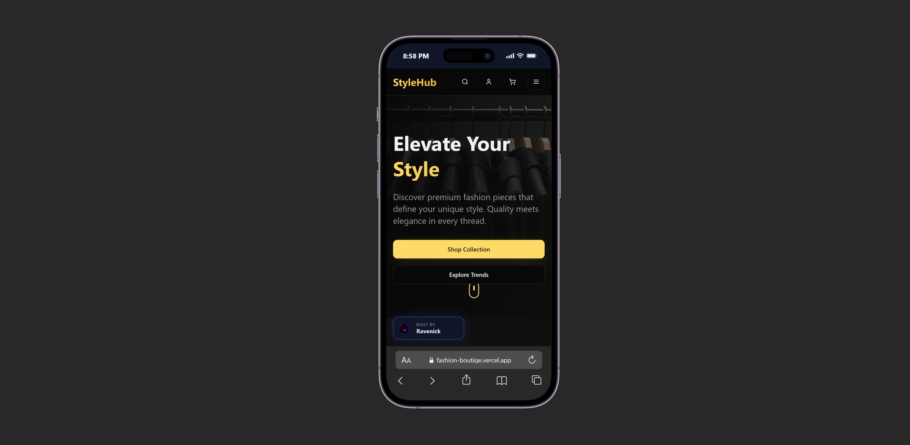
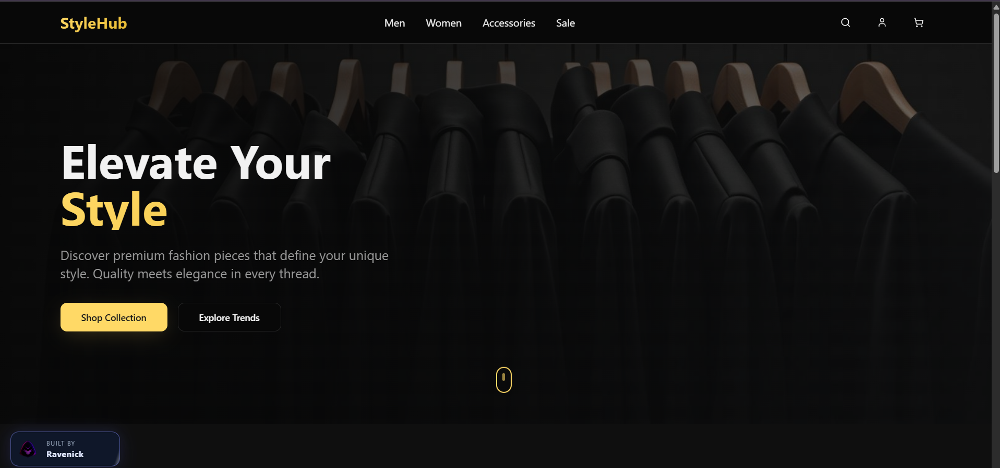

# Naira Boutique

A premium Nigerian fashion storefront built by Nelson Emmanuel | Ravenick. Naira Boutique blends a luxury dark aesthetic, curated product storytelling, and a simple shopping flow for a polished portfolio-ready brand experience.

> [!NOTE]
> This storefront is built for a high-end boutique feel with a clean, conversion-friendly shopping interface and a locally branded identity.

## Preview




## Features

- Luxury dark-mode boutique storefront with editorial product layouts
- Curated product grid with category filters and shopping cart flow
- Responsive storefront sections for featured categories and newsletter signups
- Premium product cards with promotional badges and pricing details
- Fixed Ravenick brand badge with animated sheen and non-dismissible placement
- Branded metadata, favicon, and social sharing configuration

## Built With

| Tool | Use |
| --- | --- |
| React | Product storefront interface |
| TypeScript | Type-safe app structure and data modeling |
| Vite | Fast local dev and production builds |
| Tailwind CSS | Luxury visual system and layout styling |
| shadcn/ui | Reusable UI primitives and control patterns |

## Project Structure

```text
public/
  oc-logo-no-bg.png
  robots.txt
src/
  assets/
  components/
    Cart.tsx
    Header.tsx
    Hero.tsx
    ProductCard.tsx
    ui/
  hooks/
  lib/
  pages/
    Index.tsx
    NotFound.tsx
  App.tsx
  index.css
  main.tsx
index.html
package.json
vite.config.ts
```

## Run Locally

```bash
npm install
npm run dev -- --host 127.0.0.1 --port 4178
```

Open the local Vite URL shown in the terminal to view the storefront in a browser.

Create a production build with:

```bash
npm run build
```

Run the available checks with:

```bash
npm run lint
```

## Author

Nelson Emmanuel | Ravenick

Built for elegant, modern retail experiences that feel premium and intentional.
